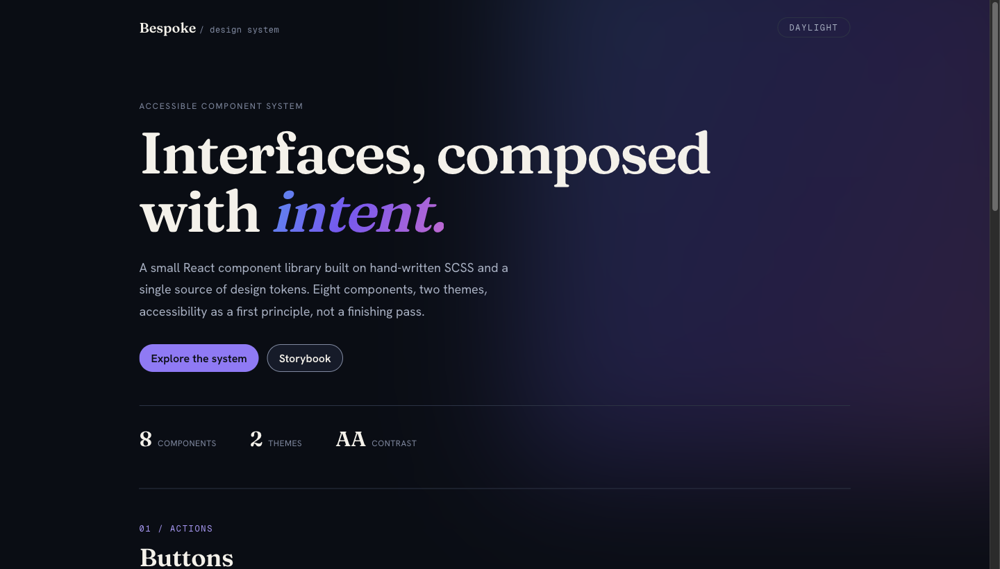

# Bespoke CSS

[](https://github.com/ryancalacsan/bespoke-css/actions/workflows/ci.yml)



A small, accessible React component library built to show design-system craft:
hand-written SCSS with BEM, one source of truth for design tokens, and
accessibility wired in from the first line rather than bolted on at the end.

It is meant to be read as much as run.

## What is here

- **React + TypeScript**, built with Vite.
- **Design tokens** as SCSS maps, mirrored to CSS custom properties.
- **Eight components** with typed props, BEM SCSS, and full keyboard and ARIA
  support: Button, TextField, Modal, Checkbox, RadioGroup, Select, Tabs, and
  Tooltip.
- **Storybook** with the accessibility (axe) addon, prop controls, and a usage
  doc per component.
- **Tests**: interaction tests that drive the keyboard flows, and visual
  regression snapshots of each component in both themes.
- **A lint and format baseline**: oxlint for TypeScript, Stylelint for SCSS,
  Prettier for everything else.

## Why no Tailwind

This is a deliberate choice, not an oversight.

Utility frameworks are a fine fit for a lot of products. They are a poor fit for
a piece whose entire point is to show CSS and design-system thinking. Tailwind
would move the interesting decisions into class strings in the markup and hide
the cascade, the naming, and the token system that this project is meant to put
on display.

Writing the styles by hand keeps a few things true:

- **The structure is visible.** BEM names say what each rule is for. A reader can
  open a `.scss` file and see the block, its elements, and its modifiers without
  decoding a chain of utilities.
- **Tokens stay central.** Components reference `var(--color-primary)` and
  `var(--space-md)`, never a raw value. Change a token in one place and the whole
  system moves with it. That is the part of a design system that matters, and it
  is hard to show through utility classes.
- **The CSS is the artifact.** For a CSS-forward role, the stylesheet is the work
  sample. Hiding it behind a framework would defeat the purpose.

None of this is a knock on utilities. It is a statement that for this brief, the
hand-written stylesheet is the point.

## Design-system thinking

The system is built in layers, each one depending only on the layer below it.

**Tokens are the source of truth.** Color, type, spacing, radii, motion, and
z-index live as SCSS maps in `src/tokens/`. Nothing in a component is a magic
number. A token is defined once and reaches the rest of the system two ways:

1. A build step walks every map and emits a matching CSS custom property on
   `:root` (`src/styles/_root.scss`). Components read `var(--space-md)`, so a
   theme can change at runtime without a rebuild.
2. Typed accessor functions (`src/styles/_functions.scss`) expose the same maps
   to Sass for the cases that need a compile-time value, like a `calc()` or a
   media query. Ask for a token that does not exist and the build stops with a
   clear error.

Edit one line in `src/tokens/`, and both paths update together.

**Color roles, not raw colors.** The palette has two levels. Primitives are the
raw ramps — `ink` (cool near-black), `bone` (warm paper), `iris` (the blue-violet
accent), plus danger and success. Semantic roles (`text`, `primary`, `danger`,
`border-strong`) are what components actually use. Every text-on-surface pairing
is chosen to meet WCAG 2.2 AA, and the pairings are verified by a script rather
than by eye (`npm run test:contrast`). That script earned its keep: it forced two
honest splits the eye would have missed — `primary` (the fill) from `accent-text`
(links and text on a tint, which a tint can never make dark enough to clear AA in
the dark theme), and `danger` (light red text) from `danger-solid` (the darker
red a button needs behind a white label).

**An editorial aesthetic.** The look is "Editorial Noir": a high-contrast serif
(Fraunces) for display, a refined grotesque (Hanken Grotesk) for UI, a monospace
(Geist Mono) for the small uppercase labels, all self-hosted via Fontsource. The
color is mostly monochrome with one iridescent accent gradient used sparingly.
None of this lives in component logic — it is the token layer, so it could be
re-skinned again the same way the dark theme was added.

**Two themes, one set of roles.** The dark theme is the payoff of that split. It
is a second set of values for the same role names, and nothing else. No
component file changed to support it. Switching is a single `data-theme="dark"`
attribute on the root, and the system also follows the OS `prefers-color-scheme`
when no choice is set. The dark theme is held to the same AA bar, which surfaced
one honest refinement: a danger button needs a dark enough red for its white
label, while danger _text_ needs a light enough red on a dark surface. Those are
different jobs, so the solid action color lives in its own role rather than being
overloaded onto the text color. The demo page has a toggle; Storybook has one in
its toolbar so the axe panel can check both themes.

**Accessibility is structural.** It is part of each component's contract:

- Components render real semantic elements. The Button is a `<button>`, so
  keyboard activation and focus come from the platform.
- Focus is always visible. A shared `focus-ring` mixin uses `:focus-visible` so
  the ring shows for keyboard users without flashing on mouse clicks.
- The Modal traps focus while open, closes on Escape, restores focus to the
  trigger on close, locks background scroll, and exposes `role="dialog"` with
  `aria-modal` and a linked title.
- The TextField wires up `htmlFor`/`id`, `aria-describedby` for help and error
  text, `aria-invalid` in the error state, and a live region so errors are
  announced. The error state also uses a non-color cue, so it does not rely on a
  user seeing red.
- Motion respects `prefers-reduced-motion`. Every animation is behind a
  motion-safe guard, with a global reduced-motion reset as a backstop.

Storybook ships with the axe addon enabled so these checks run against every
story, visibly, in the Accessibility panel.

## Testing

Two layers, both running the real components in a real browser.

**Interaction tests** live in the stories as `play` functions and run headless
through the Storybook Vitest addon (`npm test`). They drive the behavior that is
hard to eyeball: arrow-key navigation in Tabs, type-ahead and selection in
Select, the Modal focus trap and focus restore, the Tooltip showing on focus and
dismissing on Escape. Because they are play functions, the same steps also replay
visibly in Storybook's Interactions panel.

**Visual regression** lives in `tests/visual.spec.ts` and runs with Playwright
(`npm run test:visual`). It snapshots one representative story per component in
both the light and dark themes, so a styling change that shifts a pixel is caught
on review. Baselines are committed under `tests/__screenshots__/`. They carry the
OS in the file name, so a run on a different platform regenerates rather than
fails falsely; update them on purpose with `npm run test:visual:update`, and in
CI generate them in the official Playwright container so they match.

**CI** (`.github/workflows/ci.yml`) runs all of this on every push and pull
request: lint, format, types, and build in one job, the interaction tests and
the visual regression in the pinned Playwright container so the screenshots
compare against matching baselines. The committed baselines include a Linux set
generated in that same image.

## Project structure

```
src/
  tokens/            SCSS maps: the single source of truth
    _colors.scss       primitives + semantic roles (AA contrast)
    _typography.scss   modular type scale, weights, line heights
    _spacing.scss      4px spacing grid
    _radii.scss        border radii
    _elevation.scss    z-index scale + shadows
    _motion.scss       durations + easings
    _index.scss        forwards every map
  styles/            the token-to-CSS bridge and shared helpers
    _root.scss         emits custom properties from the maps
    _functions.scss    typed token accessors for Sass
    _mixins.scss       focus-ring, visually-hidden, reduced-motion
    _reset.scss        minimal modern reset
    global.scss        the entry point that ties it together
  components/
    Button/            variants, sizes, loading, disabled
    TextField/         label, help text, error state, ARIA wiring
    Modal/             focus trap, escape, focus restore, scroll lock
    Checkbox/          checked + indeterminate via pseudo-classes
    RadioGroup/        fieldset/legend group, per-option help
    Select/            ARIA listbox: activedescendant, type-ahead
    Tabs/              roving tabindex, arrow keys, automatic activation
    Tooltip/           hover + focus, escape to dismiss, describedby
  docs/
    Tokens.mdx         the token reference, rendered in Storybook
tests/
  visual.spec.ts       Playwright visual regression, light and dark
  __screenshots__/     committed baselines
```

Each component folder holds the component, its `.scss`, a typed `index.ts`, a
Storybook story (with `play` interaction tests), and a usage doc through
autodocs.

## Getting started

```bash
npm install
npm run storybook     # component docs + a11y panel at http://localhost:6006
npm run dev           # the demo page at http://localhost:5173
```

## Scripts

| Script                       | What it does                        |
| ---------------------------- | ----------------------------------- |
| `npm run dev`                | Run the Vite demo page              |
| `npm run storybook`          | Run Storybook with the a11y addon   |
| `npm test`                   | Interaction tests (play functions)  |
| `npm run test:contrast`      | Verify every color pairing meets AA |
| `npm run test:visual`        | Visual regression against baselines |
| `npm run test:visual:update` | Refresh the visual baselines        |
| `npm run build`              | Type-check and build the library    |
| `npm run build-storybook`    | Build the static Storybook site     |
| `npm run lint`               | oxlint (TS) and Stylelint (SCSS)    |
| `npm run format`             | Prettier write                      |
| `npm run typecheck`          | TypeScript, no emit                 |

## What comes next

The component set covers the common form and disclosure patterns, a dark theme
proves the token model holds, the keyboard flows and visuals are under test, and
CI runs all of it on every push. From here the system grows component by
component as real product needs surface, on the same foundation.
